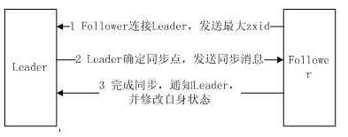

#### **题目**：zookeeper同步流程

#### **参考答案**：

选完Leader以后，zk就进入状态同步过程。 

1. Leader等待Follower和Observer连接；

2. Follower连接leader，将最大的zxid发送给leader；

3. Leader根据follower的zxid确定同步点；

4. 完成同步后通知follower 已经成为uptodate状态；

5. Follower收到uptodate消息后，又可以重新接受client的请求进行服务了。

数据同步的4种方式：

1、SNAP-全量同步
  - 条件：peerLastZxid<minCommittedLog
  - 说明：证明二者数据差异太大，follower数据过于陈旧，leader发送快照SNAP指令给follower全量同步数据，即leader将所有数据全量同步到follower

2、DIFF-增量同步
  - 条件：minCommittedLog<=peerLastZxid<=maxCommittedLog
  - 说明：证明二者数据差异不大，follower上有一些leader上已经提交的提议proposal未同步，此时需要增量提交这些提议即可

3、TRUNC-仅回滚同步
  - 条件：peerLastZxid>minCommittedLog
  - 说明：证明follower上有些提议proposal并未在leader上提交，follower需要回滚到zxid为minCommittedLog对应的事务操作

4、TRUNC+DIFF-回滚+增量同步
  - 条件：minCommittedLog<=peerLastZxid<=maxCommittedLog
  - 说明：leader a已经将事务truncA提交到本地事务日志中，但没有成功发起proposal协议进行投票就宕机了；然后集群中剔除原leader a重新选举出新leader b，又提交了若干新的提议proposal，然后原leader a重新服务又加入到集群中说明：此时a,b都有一些对方未提交的事务，若b是leader, a需要先回滚truncA然后增量同步新leader b上的数据。
